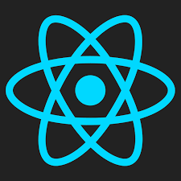

<!----!>
<!--        -->

<h1 align="center">
  
</h1>
   
###    About Me:

  <h3>👋 Hi , I’m Luca </h3>
  I'm from italy.👀  With passion for programming on front-end web development. Loves front-ended skills like HTML, CSS, JavaScript. 
   
  Currently working on React & nextJS (really cool stuff)
   
  Let's code the ideas to the future!
   
  📫 How to reach me: lucadedo99@gmail.com
   
  
 
  
  

 

<h2 align="center">🔥 Languages & Frameworks & Tools & Abilities 🔥</h2> 

  
 
  
  
  
  
  
  
  
  
  
  

<!---
lucadedo/lucadedo is a ✨ special ✨ repository because its `README.md` (this file) appears on your GitHub profile.
You can click the Preview link to take a look at your changes.
--->
